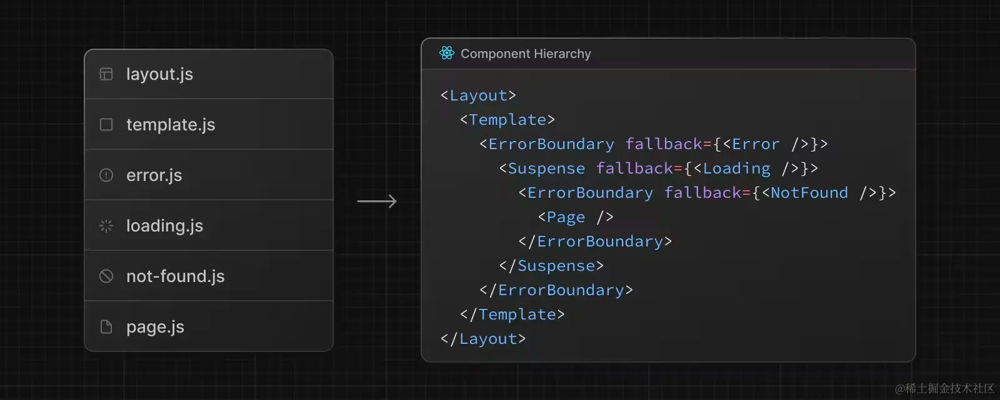

路由（Router）是 Next.js 应用的重要组成部分。在 Next.js 中，路由决定了一个页面如何渲染或者一个请求该如何返回。

Next.js 有两套路由解决方案，之前的方案称之为 `Pages Router`，目前的方案称之为 `App Router`，两套方案目前是兼容的，都可以在 Next.js 中使用。

从 v13.4 起，App Router 已成为默认的路由方案，新的 Next.js 项目建议使用 App Router。

## 文件系统（file-system）

Next.js 的路由基于的是文件系统，也就是说，一个文件就可以是一个路由。举个例子，在 `pages` 目录下创建一个 `index.js` 文件，它会直接映射到 `/` 路由地址：

```jsx
// pages/index.js
import React from 'react'
export default () => <h1>Hello world</h1>
```

在 `pages` 目录下创建一个 `about.js` 文件，它会直接映射到 `/about` 路由地址：

```jsx
// pages/about.js
import React from 'react'
export default () => <h1>About us</h1>
```

## 从 Pages Router 到 App Router

现在当用 `create-next-app` 创建的项目，会发现默认并没有 `pages` 这个目录。

因为 Next.js 从 v13 起就使用了新的路由模式——App Router。App Router 制定了更加完善的规范，使代码更好被组织和管理。

## 使用 Pages Router

当然也可以继续使用 Pages Router，如果想使用 Pages Router，只需要在 `src` 目录下创建一个 `pages` 文件夹或者在根目录下创建一个 `pages`文件夹。其中的 JS 文件会被视为 Pages Router 进行处理。

但是要注意，虽然两者可以共存，但 App Router 的优先级要高于 Pages Router。而且如果两者解析为同一个 URL，会导致构建错误。

注意：在 Next.js 官方文档进行搜索的时候，左上角会有 App 和 Pages 选项，这对应的就是 App Router 和 Pages Router，因为两种路由模式的使用方式有很大不同，所以搜索的时候注意选择正确的的路由模式。

## 使用 App Router

首先是定义路由，文件夹被用来定义路由。每个文件夹都代表一个对应到 URL 片段的路由片段。创建嵌套的路由，只需要创建嵌套的文件夹。

比如：`app/dashboard/settings`目录对应的路由地址就是 `/dashboard/settings`

### 定义页面（Pages）

那如何保证这个路由可以被访问呢？需要创建一个特殊的名为 `page.js` 的文件。至于为什么叫 `page.js`呢？除了 `page` 有“页面”这个含义之外，你可以理解为这是一种约定或者规范。（如果你是 Next.js 的开发者，你也可以约定为 `index.js`或者其它名称 `other.js`！）

**当然不止 `.js`文件，Next.js 默认是支持 React、TypeScript 的，所以 `.js`、`.jsx`、`.tsx` 都是可以的。**

那 `page.js` 的代码该如何写呢？最常见的是展示 UI，比如：

```jsx
// app/page.js
export default function Page() {
  return <h1>Hello, Next.js!</h1>
}
```

### 定义布局（Layouts）

布局是指多个页面共享的 UI。在导航的时候，布局会保留状态、保持可交互性并且不会重新渲染，比如用来实现后台管理系统的侧边导航栏。

定义一个布局，你需要新建一个名为 `layout.js`的文件，该文件默认导出一个 React 组件，该组件应接收一个 `children` prop，`chidren` 表示子布局（如果有的话）或者子页面。

举个例子，我们新建如下目录和文件：

```jsx
// app/dashboard/layout.js
export default function DashboardLayout({
  children,
}) {
  return (
    <section>
      <nav>nav</nav>
      {children}
    </section>
  )
}
```

```jsx
// app/dashboard/page.js
export default function Page() {
  return <h1>Hello, Dashboard!</h1>
}
```

其中，`nav` 来自于 `app/dashboard/layout.js`，`Hello, Dashboard!` 来自于 `app/dashboard/page.js`

**你可以发现：同一文件夹下如果有 layout.js 和 page.js，page 会作为 children 参数传入 layout。换句话说，layout 会包裹同层级的 page。**

`app/dashboard/settings/page.js` 代码如下：

```jsx
// app/dashboard/settings/page.js
export default function Page() {
  return <h1>Hello, Settings!</h1>
}
```

其中，`nav` 来自于 `app/dashboard/layout.js`，`Hello, Settings!` 来自于 `app/dashboard/settings/page.js`

**你可以发现：布局是支持嵌套的**，`app/dashboard/settings/page.js` 会使用 `app/layout.js` 和 `app/dashboard/layout.js` 两个布局中的内容。

#### 根布局（Root Layout）

布局支持嵌套，最顶层的布局我们称之为根布局（Root Layout），也就是 `app/layout.js`。它会应用于所有的路由。除此之外，这个布局还有点特殊。

使用 `create-next-app` 默认创建的 `layout.js` 代码如下：

```jsx
// app/layout.js
import './globals.css'
import { Inter } from 'next/font/google'

const inter = Inter({ subsets: ['latin'] })

export const metadata = {
  title: 'Create Next App',
  description: 'Generated by create next app',
}

export default function RootLayout({ children }) {
  return (
    <html lang="en">
      <body className={inter.className}>{children}</body>
    </html>
  )
}
```

其中：

1. `app` 目录必须包含根布局，也就是 `app/layout.js` 这个文件是必需的。
2. 根布局必须包含 `html` 和 `body`标签，其他布局不能包含这些标签。如果你要更改这些标签，不推荐直接修改。
3. 你可以使用路由组创建多个根布局。
4. 默认根布局是服务端组件，且不能设置为客户端组件。

### 定义模板（Templates）

模板类似于布局，它也会传入每个子布局或者页面。但不会像布局那样维持状态。

模板在路由切换时会为每一个 children 创建一个实例。这就意味着当用户在共享一个模板的路由间跳转的时候，将会重新挂载组件实例，重新创建 DOM 元素，不保留状态。听起来有点抽象，我们可以通过一个 demo 来理解。

定义一个模板，你需要新建一个名为 `template.js` 的文件，该文件默认导出一个 React 组件，该组件接收一个 `children` prop。我们写个示例代码。

在 `app`目录下新建一个 `template.js`文件：

```jsx
// app/template.js
export default function Template({ children }) {
  return <div>{children}</div>
}
```

你会发现，这用法跟布局一模一样。它们最大的区别就是状态的保持。如果同一目录下既有 `template.js` 也有 `layout.js`，最后的输出效果如下：

```jsx
<Layout>
  {/* 模板需要给一个唯一的 key */}
  <Template key={routeParam}>{children}</Template>
</Layout>
```

也就是说 `layout` 会包裹 `template`，`template` 又会包裹 `page`。

某些情况下，模板会比布局更适合：

- 依赖于 useEffect 和 useState 的功能，比如记录页面访问数（维持状态就不会在路由切换时记录访问数了）、用户反馈表单（每次重新填写）等
- 更改框架的默认行为，举个例子，布局内的 Suspense 只会在布局加载的时候展示一次 fallback UI，当切换页面的时候不会展示。但是使用模板，fallback 会在每次路由切换的时候展示

#### 布局 VS 模板

为了帮助大家更好的理解布局和模板，我们写一个 demo，展示下两者的特性。

项目目录如下：

```js
app
└─ dashboard
   ├─ layout.js
   ├─ page.js
   ├─ template.js
   ├─ about
   │  └─ page.js
   └─ settings
      └─ page.js
```

其中 `dashboard/layout.js` 代码如下：

```jsx
'use client'

import { useState } from 'react'
import Link from 'next/link'

export default function Layout({ children }) {
  const [count, setCount] = useState(0)
  return (
    <>
      <div>
        <Link href="/dashboard/about">About</Link>
        <br/>
        <Link href="/dashboard/settings">Settings</Link>
      </div>
      <h1>Layout {count}</h1>
      <button onClick={() => setCount(count + 1)}>
        Increment
      </button>
      {children}
    </>
  )
}
```

`dashboard/template.js` 代码如下：

```jsx
'use client'

import { useState } from 'react'

export default function Template({ children }) {
  const [count, setCount] = useState(0)
  return (
    <>
      <h1>Template {count}</h1>
      <button onClick={() => setCount(count + 1)}>
        Increment
      </button>
      {children}
    </>
  )
}
```

`dashboard/page.js`代码如下：

```jsx
export default function Page() {
  return <h1>Hello, Dashboard!</h1>
}
```

`dashboard/about/page.js`代码如下：

```jsx
export default function Page() {
  return <h1>Hello, About!</h1>
}
```

`dashboard/settings/page.js`代码如下：

```jsx
export default function Page() {
  return <h1>Hello, Settings!</h1>
}
```

现在点击两个 `Increment` 按钮，会开始计数。随便点击下数字，然后再点击 `About`或者 `Settings`切换路由，你会发现，Layout 后的数字没有发生变化，Template 后的数字重置为 0。这就是所谓的状态保持。

注：当然如果刷新页面，Layout 和 Template 后的数字肯定都重置为 0。

### 定义加载界面（Loading UI）

现在我们已经了解了 `page.js`、`layout.js`、`template.js`的功能，然而特殊文件还不止这些。App Router 提供了用于展示加载界面的 `loading.js`。

这个功能的实现借助了 React 的`Suspense` API。关于 Suspense 的用法，可以查看 [《React 之 Suspense》](https://juejin.cn/post/7163934860694781989)。它实现的效果就是当发生路由变化的时候，立刻展示 fallback UI，等加载完成后，展示数据。

```jsx
// 在 ProfilePage 组件处于加载阶段时显示 Spinner
<Suspense fallback={<Spinner />}>
  <ProfilePage />
</Suspense>
```

初次接触 Suspense 这个概念的时候，往往会有一个疑惑，那就是——“在哪里控制关闭 fallback UI 的呢？”

哪怕在 React 官网中，对背后的实现逻辑并无过多提及。但其实实现的逻辑很简单，简单的来说，ProfilePage 会 throw 一个数据加载的 promise，Suspense 会捕获这个 promise，追加一个 then 函数，then 函数中实现替换 fallback UI 。当数据加载完毕，promise 进入 resolve 状态，then 函数执行，于是更新替换 fallback UI。

了解了原理，那我们来看看如何写这个 `loading.js`吧。`dashboard` 目录下我们新建一个 `loading.js`。

```jsx
// app/dashboard/loading.js
export default function DashboardLoading() {
  return <>Loading dashboard...</>
}
```

同级的 `page.js` 代码如下：

```jsx
// app/dashboard/page.js
async function getData() {
  await new Promise((resolve) => setTimeout(resolve, 3000))
  return {
    message: 'Hello, Dashboard!',
  }
}
export default async function DashboardPage(props) {
  const { message } = await getData()
  return <h1>{message}</h1>
}
```

不再需要其他的代码，loading 的效果就实现了

就是这么简单。其关键在于 `page.js`导出了一个 async 函数。

`loading.js` 的实现原理是将 `page.js`和下面的 children 用 `<Suspense>` 包裹。因为`page.js`导出一个 async 函数，Suspense 得以捕获数据加载的 promise，借此实现了 loading 组件的关闭。

当然实现 loading 效果，不一定非导出一个 async 函数。也可以借助 React 的 `use` 函数。现在我们在 `dashboard`下新建一个 `about`目录，在其中新建 `page.js`文件。

`/dashboard/about/page.js` 代码如下：

```jsx
// /dashboard/about/page.js
import { use } from 'react'

async function getData() {
  await new Promise((resolve) => setTimeout(resolve, 5000))
  return {
    message: 'Hello, About!',
  }
}

export default function Page() {
  const {message} = use(getData())
  return <h1>{message}</h1>
}
```

如果你想针对 `/dashboard/about` 单独实现一个 loading 效果，那就在 `about` 目录下再写一个 `loading.js` 即可。

如果同一文件夹既有 `layout.js` 又有 `template.js` 又有 `loading.js` ，那它们的层级关系是怎样呢？

对于这些特殊文件的层级问题，直接一张图搞定：



### 定义错误处理（Error Handling）

再讲讲特殊文件 `error.js`。顾名思义，用来创建发生错误时的展示 UI。

其实现借助了 React 的 [Error Boundary](https://link.juejin.cn/?target=https%3A%2F%2Freact.dev%2Freference%2Freact%2FComponent%23catching-rendering-errors-with-an-error-boundary) 功能。简单来说，就是给 page.js 和 children 包了一层 `ErrorBoundary`。

写一个 demo 演示一下 `error.js` 的效果。`dashboard` 目录下新建一个 `error.js`，代码如下：

```jsx
'use client' // 错误组件必须是客户端组件
// dashboard/error.js
import { useEffect } from 'react'
 
export default function Error({ error, reset }) {
  useEffect(() => {
    console.error(error)
  }, [error])
 
  return (
    <div>
      <h2>Something went wrong!</h2>
      <button
        onClick={
          // 尝试恢复
          () => reset()
        }
      >
        Try again
      </button>
    </div>
  )
}
```

为触发 Error 错误，同级 `page.js` 的代码如下：

```jsx
"use client";
// dashboard/page.js
import React from "react";

export default function Page() {
  const [error, setError] = React.useState(false);

  const handleGetError = () => {
    setError(true);
  };

  return (
    <>{error ? Error() : <button onClick={handleGetError}>Get Error</button>}</>
  );
}
```

有时错误是暂时的，只需要重试就可以解决问题。所以 Next.js 会在 `error.js` 导出的组件中，传入 `reset` 函数，帮助尝试从错误中恢复。该函数会触发重新渲染错误边界里的内容。如果成功，会替换展示重新渲染的内容。

当时结合上面提到的层级相关内容，会发现：因为 `Layout` 和 `Template` 在 `ErrorBoundary` 外面，这说明错误边界不能捕获同级的 `layout.js` 或者 `template.js` 中的错误。如果你想捕获特定布局或者模板中的错误，那就需要在父级的 `error.js` 里进行捕获。

那问题来了，如果已经到了顶层，就比如根布局中的错误如何捕获呢？为了解决这个问题，Next.js 提供了 `global-error.js`文件，使用它时，需要将其放在 `app` 目录下。

`global-error.js`会包裹整个应用，而且当它触发的时候，它会替换掉根布局的内容。所以，`global-error.js` 中也要定义 `<html>` 和 `<body>` 标签。

`global-error.js`示例代码如下：

```jsx
'use client'
// app/global-error.js
export default function GlobalError({ error, reset }) {
  return (
    <html>
      <body>
        <h2>Something went wrong!</h2>
        <button onClick={() => reset()}>Try again</button>
      </body>
    </html>
  )
}
```

注：`global-error.js` 用来处理根布局和根模板中的错误，`app/error.js` 建议还是要写的

### 定义 404 页面

最后再讲一个特殊文件 —— `not-found.js`。顾名思义，当该路由不存在的时候展示的内容。

Next.js 项目默认有一个404 not found样式的效果。

如果要替换这个效果，只需要在 `app` 目录下新建一个 `not-found.js`，代码示例如下：

```jsx
import Link from 'next/link'
 
export default function NotFound() {
  return (
    <div>
      <h2>Not Found</h2>
      <p>Could not find requested resource</p>
      <Link href="/">Return Home</Link>
    </div>
  )
}
```

关于 `app/not-found.js` 一定要说明一点的是，它只能由两种情况触发：

1. 当组件抛出了 notFound 函数的时候
2. 当路由地址不匹配的时候

所以 `app/not-found.js` 可以修改默认 404 页面的样式。但是，如果 `not-found.js`放到了任何子文件夹下，它只能由 `notFound`函数手动触发。比如这样：

```jsx
// /dashboard/blog/page.js
import { notFound } from 'next/navigation'

export default function Page() {
  notFound()
  return <></>
}
```

执行 notFound 函数时，会由最近的 not-found.js 来处理。但如果直接访问不存在的路由，则都是由 `app/not-found.js` 来处理。

对应到实际开发，当我们请求一个用户的数据时或是请求一篇文章的数据时，如果该数据不存在，就可以直接丢出 `notFound` 函数，渲染自定义的 `not-found.js` 界面。示例代码如下：

```jsx
// app/dashboard/blog/[id]/page.js
import { notFound } from 'next/navigation'
 
async function fetchUser(id) {
  const res = await fetch('https://...')
  if (!res.ok) return undefined
  return res.json()
}
 
export default async function Profile({ params }) {
  const user = await fetchUser(params.id)
 
  if (!user) {
    notFound()
  }
 
  // ...
}
```

App Router 制定了更加完善的规范，使代码更好被组织和管理。

```js
src/
└── app
    ├── page.js 
    ├── layout.js
    ├── template.js
    ├── loading.js
    ├── error.js
    └── not-found.js
    ├── about
    │   └── page.js
    └── more
        └── page.js
```
